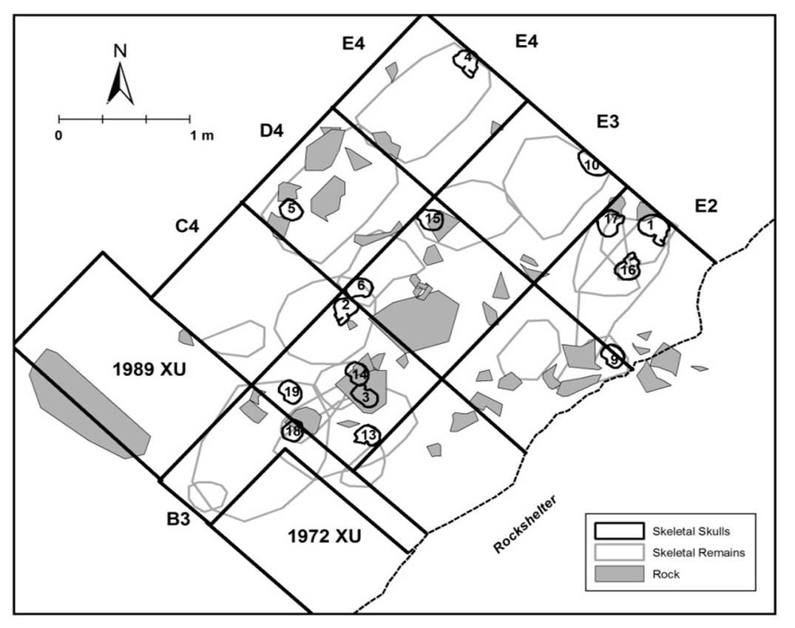
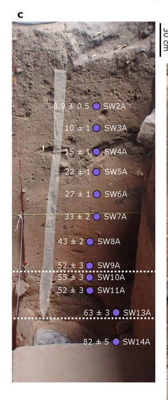
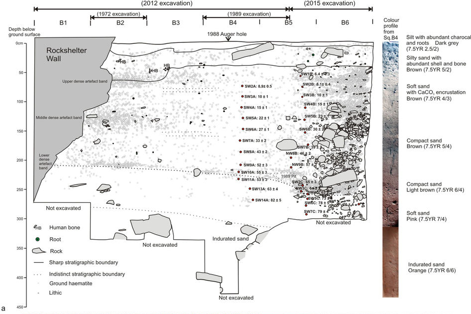
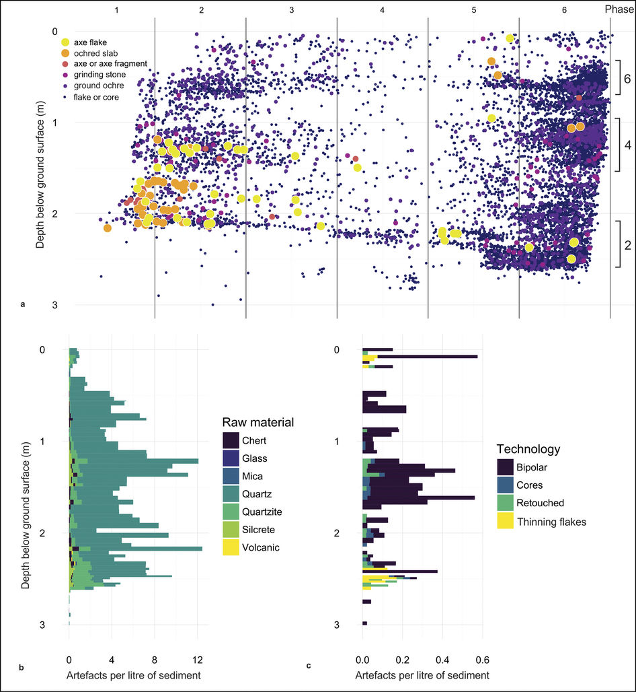
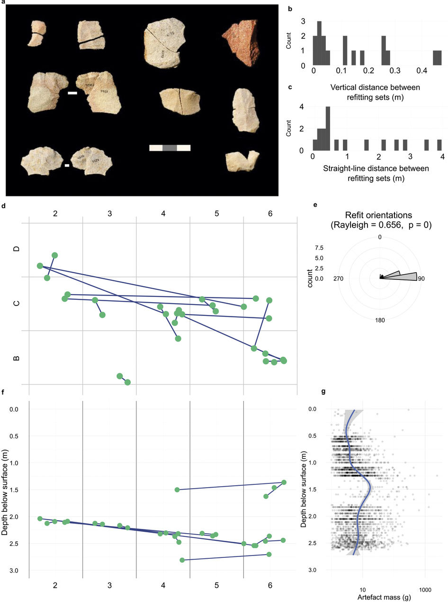

```{r include=FALSE}
knitr::opts_chunk$set(echo = FALSE,
                      warning = FALSE,
                      message = FALSE,
                      quiet = TRUE,
                      progress=FALSE)
# Submission preparation guidelines:
# http://www.nature.com/nature/authors/gta/
# Nature’s standard figure sizes are 89 mm (single column) and 183 mm (double column) and the full depth of the page is 247 mm.
library(tidyverse)
library(ggrepel)
```


<!-- run code from prepare_data chunk in supplementary information-->

```{r echo=FALSE}
library(knitr)
invisible(purl("supplementary_information.Rmd", output="temp", quiet=TRUE))
read_chunk("temp")
```

```{r ref.label='prepare_data', results='hide', cache=TRUE}
```

```{r ref.label='getages', results='hide', cache=TRUE}
```

```{r echo=FALSE}
unlink("temp")
```

## OSL ages for lowest artefact band are consistent across the site

Kaifu and Shitaoka write:

"First, the OSL ages for the lowest dense artifact band (called as the ‘zone of initial
human occupation’) are different as much as 10,000 years between the two main
sections. The ages were ~53,000–55,000 years ago at square B4 (SW–A series), whereas
~57,000–65,000 years ago at a location one meter apart from there (SW–B/C series at
square B5). The lower limit of this artifact band at square B4 has been lowered in Extended Data Figure 8c (the lower stippled line), but this must be an error because such a lower limit cannot be supported from the artifact distribution and the lithic artifact refitting analysis illustrated in Extended Data Figures 1, 2 and 6. The observed internal inconsistency indicates that either or both of the OSL ages have considerable errors."

So let's see what is the age of phase 2 in square B4 compared to B5.

- B4 is located in the area of the 1989 excavation. Our 2012 and 2015 excavations removed backfill from the 1989 excavation. We don't have any stone artefacts from B4 for a direct correlation with the depth of the OSL samples.  

- C4 artefacts in the lowest layer are about 5 cm higher than the same band of lowest artefacts in B5. This is due to the overall slope of the deposit, with the rear of the rockshelter sloping down to the dripline. In B5 the base of this layer is 2.35 m below the surface, and in C4 it is at 2.4 m below the surface. 

- At the base of phase 2 in C4, we have an age of 55.7 ka (SW10A), and at the base of phase 2 in B5 we have an age of 68.8 ka (SW2C). This is the ~10 ka difference that K & S have mentioned. 



Here is EDF 8C, showind OSL samples in the section of B4, the white stipple indicate the lowest dense layer of stone artefacts, the upper boundary of this layer passing between OSL samples SW9A and SW10A:



Here is EDF 1, the stipple lines here do _not_ indicate artefact deposits, but instead indicate stratigraphic boundaries. The line passes between SW10A and SW11A, indicating that the stratigraphic boundary is below the top of the artefact layer. The artefact layer and stratigraphic boundaries do not align exactly. The 1989 pit is a stratigraphic feature, notated here with a stipple line, because of its distinctive texture and colour, in addition to having a high density of artefacts. This misinterpretation of the stipple lines in EDF8c and EDF 1 is the source of the first objection by K & S.



Here is EDF 2, below, showing the locations of the phases of artefacts. Phases 2 is the lowest dense layer, identified on EDF 1 as the 'Lower dense artefact band', and in EDF 8c by the stipple lines. Recalling that the stipple line in EDF 1 is a stratigraphic indicator rather than an indicator of an artefact layer, we see no inconsistency between EDF 2 and the other figures.



Here is EDF 6, showing the artefact refitting data. The depths in panel c are consistent with the depths of phase 2 in the above figures. 



```{r fullsection, fig.width=6}
stone_artefacts_only_BC <- 
  stone_artefacts_only %>% 
  filter(square %in% c("B4", "B5", "B6", "C4", "C5", "C6"))


# these are the vertical lines
row_c <- c(2.4, 1.4, 0.4, -0.6, -1.6, -2.6, -3.6)
row_mids <- row_c/2

library(viridis)
library(grid)
p <- ggplot(stone_artefacts_only,
       aes(Xnew_flipped,
           depth_below_ground_surface,
           colour = find)) +
  geom_point(size = 0.5) +
  scale_y_reverse(limits = c(3,0), 
                  breaks = seq(0, 3, 0.1)) +
  theme_minimal() +
  scale_x_continuous(breaks = row_c,
                     labels = NULL) +
  xlab("") +
  ylab("Depth below \nground surface (m)") +
  scale_color_viridis(discrete=TRUE,
                      "Artefact\ntype") +
  geom_segment(aes(x = -3.6,  
               y = 2.4,
               xend = 0.9,
               yend = 2.4),
               colour = "red") +
    geom_segment(aes(x = -3.6,    # B4
               y = 2.35,
               xend = -0.1,
               yend = 2.35),
               colour = "red") +
  coord_equal() +
  guides(colour = guide_legend(override.aes = list(size = 5))) +
  ggtitle("MJB SW Section with all lithics",
          "showing depths of base of phase 2 in B4 and B5")

row_c = c(2.4, 1.4, 0.4, -0.6, -1.6, -2.6, -3.6)
nums = paste0("B", 6:1)
row_mids <-  row_c[-length(row_c)] + diff(row_c)/2

for(i in 1:length(row_mids)){
p = p + annotation_custom(grob = textGrob(nums[i], gp=gpar(fontsize=10)),
                         xmin =  row_mids[i],
                         xmax =  row_mids[i],
                         ymin = -8.5,
                         ymax = 2)
}

# Code to override clipping
grid.newpage()
gt <- ggplot_gtable(ggplot_build(p))
gt$layout$clip[gt$layout$name=="panel"] <- "off"
grid.draw(gt)
```

```{r Bsection, fig.width=6}

library(viridis)
library(grid)
p <- ggplot(stone_artefacts_only_BC,
       aes(Xnew_flipped,
           depth_below_ground_surface)) +
  geom_point(size = 0.5, colour = "black") +
  scale_y_reverse(limits = c(3,0), 
                  breaks = seq(0, 3, 0.1)) +
  theme_minimal() +
  scale_x_continuous(breaks = row_c,
                     labels = NULL) +
  xlab("") +
  ylab("Depth below \nground surface (m)") +
  scale_color_viridis(discrete=TRUE,
                      "Artefact\ntype") +
  geom_segment(aes(x = -3.6,  
               y = 2.4,
               xend = 0.9,
               yend = 2.4),
               colour = "red") +
    geom_segment(aes(x = -3.6,    # B4
               y = 2.35,
               xend = -0.1,
               yend = 2.35),
               colour = "red") +
  coord_equal() +
  guides(colour = guide_legend(override.aes = list(size = 5))) +
  ggtitle("MJB SW Section, lithics only from B-C squares",
          "showing depths of base of phase 2 in B4 and B5")

row_c = c(2.4, 1.4, 0.4, -0.6, -1.6, -2.6, -3.6)
nums = paste0("B", 6:1)
row_mids <-  row_c[-length(row_c)] + diff(row_c)/2

for(i in 1:length(row_mids)){
p = p + annotation_custom(grob = textGrob(nums[i], gp=gpar(fontsize=10)),
                         xmin =  row_mids[i],
                         xmax =  row_mids[i],
                         ymin = -8.5,
                         ymax = 2)
}

# Code to override clipping
grid.newpage()
gt <- ggplot_gtable(ggplot_build(p))
gt$layout$clip[gt$layout$name=="panel"] <- "off"
grid.draw(gt)
```

```{r}

# these are the vertical lines
row_c <- c(2.4, 1.4, 0.4, -0.6, -1.6, -2.6, -3.6)
row_mids <- row_c/2

p1 <- 
ggplot() +
  coord_equal() +
    scale_y_reverse(limits = c(3,0), 
                  breaks = seq(0, 3, 0.1)) +
  scale_x_continuous(breaks = row_c,
                     labels = NULL) +
    geom_point(data = stone_artefacts_only_BC,
           aes(Xnew_flipped,
           depth_below_ground_surface),
           colour = "grey80",
           size = 0.5)  +
    geom_segment(aes(x = -0.5,          # C4
               y = 2.4,
               xend = 0.9,
               yend = 2.4),
               colour = "red") +
    geom_segment(aes(x = -0.5,        # B5
               y = 2.35,
               xend = -0.1,
               yend = 2.35),
               colour = "red") +
  geom_point(data = osl_ages[grepl("SW", osl_ages$Sample), ],
             aes(Xnew_flipped,
                 depth_below_ground_surface ),
             colour = "red") +
  geom_text_repel(data =  osl_ages[grepl("SW", osl_ages$Sample), ],
                  aes(Xnew_flipped,
                      depth_below_ground_surface,
                      label = paste0(osl_age, " (", Sample, ")" )),
                  size = 3) +
  ylab("Depth below \nground surface (m)") +

  xlab("") +
  theme_minimal() +
  ggtitle("MJB SW Section, lithics only from B-C squares",
          "showing OSL sample locations and depths of base of phase 2 in B4 and B5")

row_c = c(2.4, 1.4, 0.4, -0.6)
nums = paste0("B", 6:3)
row_mids <-  row_c[-length(row_c)] + diff(row_c)/2

for(i in 1:length(row_mids)){
p1 = p1 + annotation_custom(grob = textGrob(nums[i], gp=gpar(fontsize=10)),
                         xmin =  row_mids[i],
                         xmax =  row_mids[i],
                         ymin = -8.5,
                         ymax = 2)
}

# Code to override clipping
grid.newpage()
gt1 <- ggplot_gtable(ggplot_build(p1))
gt1$layout$clip[gt1$layout$name=="panel"] <- "off"
grid.draw(gt1)
```

Let's look at the artefact discard patterns in these squares:

```{r}
library(readxl)
artefacts_per_litre <- read_excel("data/stone_artefact_data/Artefacts per litre discard BC4-6 by depth.xlsx")

C4 <- artefacts_per_litre[1:nrow(artefacts_per_litre) , 1:4]
names(C4) <- C4[1, ]
C4 <- C4[-1, ]
C4 <- map_df(C4, as.numeric)

B4 <- artefacts_per_litre[1:nrow(artefacts_per_litre) , 6:11]
names(B4) <- B4[1, ]
B4 <- B4[-1, ]
B4 <- map_df(B4, as.numeric)

B5 <- artefacts_per_litre[1:nrow(artefacts_per_litre) , 13:16]
names(B5) <- B5[1, ]
B5 <- B5[-1, ]
B5 <- map_df(B5, as.numeric)

B6 <- artefacts_per_litre[1:nrow(artefacts_per_litre) , 18:22]
names(B6) <- B6[1, ]
B6 <- B6[-1, ]
B6 <- map_df(B6, as.numeric)

C5 <- artefacts_per_litre[1:nrow(artefacts_per_litre) , 24:28]
names(C5) <- C5[1, ]
C5 <- C5[-1, ]
C5 <- map_df(C5, as.numeric)

C6 <- artefacts_per_litre[1:nrow(artefacts_per_litre) , 30:34]
names(C6) <- C6[1, ]
C6 <- C6[-1, ]
C6 <- map_df(C6, as.numeric)

# combine these into one df
the_list <- list("B4"=B4, "B5"=B5, "B6"=B6,
          "C4"=C4, "C5"=C5, "C6"=C6)
artefacts_per_litre_long <- 
bind_rows(the_list,
          .id = "id")

# Depth in two cols...
artefacts_per_litre_long$depth <- 
  with(artefacts_per_litre_long, ifelse(is.na(depth), 
                                        Depth, depth))

vlines <- data.frame(id = rep(names(the_list), 2), 
                     xintercept =c(rep(c(2.1, 
                                        2.2,
                                        2.25), 2),
                                  rep(c(2.5,
                                        2.65, 
                                        2.7), 2)))
                     
                                    
                                  

ggplot(artefacts_per_litre_long,
       aes(depth, 
           `Artefacts/Litre`)) +
  geom_line() +
  facet_wrap(~id, scales = "free_y") +
  geom_vline(data = vlines, 
             aes(xintercept = xintercept),
             colour = "red") +
  geom_text(data = vlines, 
           aes(
           x = xintercept,
           y = -0.5,
           label = xintercept),
           size = 3) +
  theme_minimal() +
  xlab("Depth below surface (m)")
```


## OSL and C14 ages are in agreement with each other

Kaifu and Shitaoka write:

"Second, contrary to the authors’ statement, the reported radiocarbon and OSL
chronologies are not in agreement with each other. Among the seven radiocarbon ages
measured below the –110 cm level (> 20,000 years ago in the OSL time scale), six of
them collectively shows its own time trajectory which is younger than the OSL time
scale in Extended Data Figure 8g. Clarkson and colleagues suggested ~30–50 cm
downward relocation for the two dated charcoals either by artificial or natural processes
(Supplementary Information, p.18 in ref. 1). Even if we accept this possibility, the
claimed consistency is unsound in the lower stratigraphic section because it is
supported by single isolated charcoal (OZT592). Such a piece could be intruded from
nearby older deposit in a sandy area like Madjedbebe."

"The data from the squares E and D series show more obvious inconsistency between the
two dating methods, although this point was not mentioned by Clarkson and colleagues.
Stratigraphic correlations could not be established between the opposite ends of the
excavated grids, that is, between the area around square B4 and the area around
square E2 (ref. 1). Because of this, the OSL ages plotted in Extended Data Figure 8g
were restricted to the former (square B4, B5, and C4), although this chart includes
radiocarbon ages from both areas (C3, C4, C5, E3, and E4) except for the data from
square D2 (Wk43606). In order to look at tendency in each area, in Table 1, we compiled
two regional data sets from Supplementary Tables 2, 5, and 6 (ref. 1), focusing on
chronologies between the –90 and –200 cm levels from where the radiocarbon data are
available. In the area around E2, two radiocarbon ages from the hearths at about –100
cm level (Wk43610 and Wk43606) are younger than the OSL age 10 cm above (NE3) by
~3,000–7,000 years. Overall, the radiocarbon data suggests a younger chronology than
the OSL results, or more appropriately, the number of reported radiocarbon ages is too
small to settle this question."


So, let's have a look at the correlation between the C14 and OSL ages at the site.

```{r}
library(ggrepel)
formula <- y ~ poly(x, 2)

excluding <- c("Wk43605", # pit feature
               #"Wk43606", 
               #"Wk43607", 
               #"Wk43610", 
               #"Wk43604",
               #"Wk43611",
               #"OZT591",
               "OZT593")

squares <- "B3|B4|B5|C3|C4|C5|D3|D4|D5|E3|E4|E5"

c14_ages_excludes <-  c14_ages[!grepl(paste0(excluding, collapse = "|"), c14_ages$Lab.ID), ]
c14_ages_excludes <- c14_ages_excludes[grepl(paste0(squares, collapse = "|"), c14_ages_excludes$square), ]

ggplot() +
    geom_point(data = osl_ages,
             aes(-total_station_depth_below_surf, 
                 osl_age),
             colour = viridis(3)[1]) +
    geom_smooth(data = osl_ages,
             aes(-total_station_depth_below_surf, 
                 osl_age),
              colour = viridis(3)[1],
              method = "lm", 
              formula = formula, 
              fullrange = TRUE) +
    geom_text_repel(data = osl_ages,
             aes(-total_station_depth_below_surf, 
                 osl_age,
                 label = Sample),
             size = 2) +
    geom_point(data =c14_ages_excludes,
             aes(-depth_below_surface, 
                 Bchron_Median/1000),
             colour = viridis(3)[3]) +
    geom_smooth(data = c14_ages_excludes,
              aes(-depth_below_surface, 
                 Bchron_Median/1000),
              method = "lm", 
              formula = formula, 
              fullrange = TRUE,
              colour = viridis(3)[3]) +
      geom_text_repel(data = c14_ages_excludes,
             aes(-depth_below_surface, 
                 Bchron_Median/1000,
                 label = Lab.ID),
             size = 2) +
   annotate("text", x = 2.7, y = 10, 
            label = paste0("Excluding:\n", paste0(excluding, collapse = "\n")), 
            size = 2)  +
  theme_minimal() +
  ylab("age ka") +
  xlab("Depth below surface (m)") +
  ggtitle("All OSL ages with all C14 ages from rows 3-5")
```


```{r}
library(ggrepel)
formula <- y ~ poly(x, 2)

ggplot() +
    geom_point(data = osl_ages,
             aes(-total_station_depth_below_surf, 
                 osl_age),
             colour = viridis(3)[1]) +
    geom_smooth(data = osl_ages,
             aes(-total_station_depth_below_surf, 
                 osl_age),
              colour = viridis(3)[1],
              method = "lm", 
              formula = formula, 
              fullrange = TRUE) +
    geom_text_repel(data = osl_ages,
             aes(-total_station_depth_below_surf, 
                 osl_age,
                 label = Sample),
             size = 2) +
    geom_point(data = c14_ages[grepl("D|E", c14_ages$square_spit), ],
             aes(-depth_below_surface, 
                 Bchron_Median/1000),
             colour = viridis(3)[3]) +
    geom_smooth(data = c14_ages[grepl("D|E", c14_ages$square_spit), ],
              aes(-depth_below_surface, 
                 Bchron_Median/1000),
              method = "lm", 
              formula = formula, 
              fullrange = TRUE,
              colour = viridis(3)[3]) +
      geom_text_repel(data = c14_ages[grepl("D|E", c14_ages$square_spit), ],
             aes(-depth_below_surface, 
                 Bchron_Median/1000,
                 label = Lab.ID),
             size = 2) +
  theme_minimal() +
  ylab("age ka") +
  xlab("Depth below surface (m)") +
  ggtitle("All OSL with C14 ages only from squares D and E")
```

```{r}
ggplot() +
  geom_point(data = c14_ages[grepl("B|C", c14_ages$square_spit), ],
             aes(-depth_below_surface, 
                 Bchron_Median/1000),
             colour = viridis(3)[1]) +
  geom_smooth(data = c14_ages[grepl("B|C", c14_ages$square_spit), ],
              aes(-depth_below_surface, 
                 Bchron_Median/1000),
              method = "lm", 
              formula = formula, 
              fullrange = TRUE,
              colour = viridis(3)[1]) +
  geom_text_repel(data = c14_ages[grepl("B|C", c14_ages$square_spit), ],
             aes(-depth_below_surface, 
                 Bchron_Median/1000,
                 label = Lab.ID),
             size = 2) +
  geom_point(data = c14_ages[grepl("D|E", c14_ages$square_spit), ],
             aes(-depth_below_surface, 
                 Bchron_Median/1000),
             colour = viridis(3)[3]) +
  geom_smooth(data = c14_ages[grepl("D|E", c14_ages$square_spit), ],
              aes(-depth_below_surface, 
                 Bchron_Median/1000),
              method = "lm", 
              formula = formula, 
              fullrange = TRUE,
              colour = viridis(3)[3]) +
  geom_text_repel(data = c14_ages[grepl("D|E", c14_ages$square_spit), ],
             aes(-depth_below_surface, 
                 Bchron_Median/1000,
                 label = Lab.ID),
             size = 2) +
  theme_minimal() +
  ylab("age ka") +
  xlab("Depth below surface (m)") +
  ggtitle("C14 ages from squares D & E vs B & C")
```

```{r}
ggplot() +
      geom_point(data = osl_ages[grepl("NE", osl_ages$Sample), ],
             aes(-total_station_depth_below_surf, 
                 osl_age),
             colour = viridis(3)[1]) +
    geom_smooth(data = osl_ages[grepl("NE", osl_ages$Sample), ],
             aes(-total_station_depth_below_surf, 
                 osl_age),
              colour = viridis(3)[1],
              method = "lm", 
              formula = formula, 
              fullrange = TRUE) +
    geom_text_repel(data = osl_ages[grepl("NE", osl_ages$Sample), ],
             aes(-total_station_depth_below_surf, 
                 osl_age,
                 label = Sample),
             size = 2) +
  geom_point(data = c14_ages[grepl("D|E", c14_ages$square_spit), ],
             aes(-depth_below_surface, 
                 Bchron_Median/1000),
             colour = viridis(3)[3]) +
  geom_smooth(data = c14_ages[grepl("D|E", c14_ages$square_spit), ],
              aes(-depth_below_surface, 
                 Bchron_Median/1000),
              method = "lm", 
              formula = formula, 
              fullrange = TRUE,
              colour = viridis(3)[3]) +
  geom_text_repel(data = c14_ages[grepl("D|E", c14_ages$square_spit), ],
             aes(-depth_below_surface, 
                 Bchron_Median/1000,
                 label = Lab.ID),
             size = 2) +
  theme_minimal() +
  ylab("age ka") +
  xlab("Depth below surface (m)") +
  ggtitle("OSL ages from NE column & C14 ages from squares D & E")
```


```{r}
back <- "1|2"
front <- "3|4|5"

ggplot() +
  # back
    geom_point(data = c14_ages[grepl(back, c14_ages$square), ],
             aes(-depth_below_surface, 
                 Bchron_Median/1000),
             colour = viridis(3)[1]) +
  geom_smooth(data = c14_ages[grepl(back, c14_ages$square), ],
              aes(-depth_below_surface, 
                 Bchron_Median/1000),
              method = "lm", 
              formula = formula, 
              fullrange = TRUE,
              colour = viridis(3)[1]) +
  geom_text_repel(data = c14_ages[grepl(back, c14_ages$square), ],
             aes(-depth_below_surface, 
                 Bchron_Median/1000,
                 label = Lab.ID),
             size = 2) +
  # front
      geom_point(data = c14_ages[grepl(front, c14_ages$square), ],
             aes(-depth_below_surface, 
                 Bchron_Median/1000),
             colour = viridis(3)[3]) +
  geom_smooth(data = c14_ages[grepl(front, c14_ages$square), ],
              aes(-depth_below_surface, 
                 Bchron_Median/1000),
              method = "lm", 
              formula = formula, 
              fullrange = TRUE,
              colour = viridis(3)[3]) +
  geom_text_repel(data = c14_ages[grepl(front, c14_ages$square), ],
             aes(-depth_below_surface, 
                 Bchron_Median/1000,
                 label = Lab.ID),
             size = 2) +
  theme_minimal() +
  ylab("age ka") +
  xlab("Depth below surface (m)") +
  ggtitle("C14 ages from back (rows 1, 2) and front (rows 3, 4, 5)")

```

```{r}
ggplot() +
      geom_point(data = osl_ages[grepl("NE", osl_ages$Sample), ],
             aes(-total_station_depth_below_surf, 
                 osl_age),
             colour = viridis(3)[1]) +
    geom_smooth(data = osl_ages[grepl("NE", osl_ages$Sample), ],
             aes(-total_station_depth_below_surf, 
                 osl_age),
              colour = viridis(3)[1],
              method = "lm", 
              formula = formula, 
              fullrange = TRUE) +
    geom_text_repel(data = osl_ages[grepl("NE", osl_ages$Sample), ],
             aes(-total_station_depth_below_surf, 
                 osl_age,
                 label = Sample),
             size = 2) +
  geom_point(data = osl_ages[grepl("SW", osl_ages$Sample), ],
             aes(-total_station_depth_below_surf, 
                 osl_age),
             colour = viridis(3)[3]) +
    geom_smooth(data = osl_ages[grepl("SW", osl_ages$Sample), ],
             aes(-total_station_depth_below_surf, 
                 osl_age),
              colour = viridis(3)[3],
              method = "lm", 
              formula = formula, 
              fullrange = TRUE) +
    geom_text_repel(data = osl_ages[grepl("SW", osl_ages$Sample), ],
             aes(-total_station_depth_below_surf, 
                 osl_age,
                 label = Sample),
             size = 2) +
  theme_minimal() +
  ylab("age ka") +
  xlab("Depth below surface (m)") +
  ggtitle("OSL ages from NE column & OSL ages from SW columns")
```

